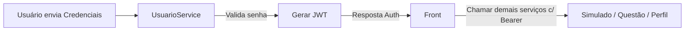

# 🧑‍💻 Microserviço de Usuário — BrainWin

Este serviço é responsável pela **gestão de usuários** da plataforma BrainWin, incluindo cadastro, autenticação, controle de wins e permissões. Ele comunica-se com os demais microserviços utilizando **JWT** e APIs REST.

---

## 🚀 Visão Geral

O microserviço de Usuário provê:

✅ Registro de novos usuários  
✅ Autenticação com JWT  
✅ Gestão de permissões (USER / ADMIN)  
✅ Atualização de dados do usuário  
✅ Controle da moeda virtual _Wins_  
✅ Consulta ao usuário logado (/users/me)

Este microserviço é utilizado diretamente pelo **front-end e pelo microserviço de simulado**, que debita wins ao iniciar um simulado.

---

## 🔄 Fluxo Geral da Solução



**Autorização distribuída** → Cada microserviço valida o token enviado pelo front nas chamadas subsequentes.

---

## 🏛️ Arquitetura da Solução

- Spring Boot 3.4
- MongoDB Atlas (Replica Set)
- JWT (Auth)
- API REST com validação por header `Authorization: Bearer <token>`
- Repository Pattern com Spring Data MongoDB

📌 Tipos de comunicação:
| Componente | Consome Usuário? | Para quê? |
|----------|:---:|-------------|
| Front-End | ✅ | Login e cadastro |
| MS Simulado | ✅ | Buscar dados do aluno / atualizar wins |
| MS Perfil | ❌ | Apenas recebe user_id como referência |
| MS Questões | ❌ | Apenas recebe user_id como referência |

---

## ⚙️ Instalação e Configuração

### ✅ Requisitos

- Java 21+
- Maven 3.9+
- Conexão com MongoDB (Atlas ou local)

### 🔌 Variáveis de Ambiente / `application.properties`

```properties
spring.data.mongodb.uri=${MONGO_URI}
spring.data.mongodb.database=brainwinTest

jwt.secret=${JWT_SECRET}
jwt.expiration-ms=86400000
```

### ▶️ Executando

```sh
mvn clean package
java -jar target/usuario-0.0.1-SNAPSHOT.jar
```

Servidor inicia em:  
📍 `http://localhost:8080`

---

## 📡 Principais Rotas

### 🔐 Autenticação

| Método | Rota | Autenticação | Descrição |
|--|--|--|--|
| POST | `/auth/login` | ❌ | Realiza login e retorna token |
| POST | `/auth/register` | ❌ | Registra usuário + cria perfil + cria Plano |

📝 Exemplo Login — Body JSON:
```json
{ "email": "user@email.com", "senha": "123456" }
```

Resposta:
```json
{
  "token": "<JWT>",
  "type": "Bearer"
}
```

---

### 👤 Gestão de Usuário

| Método | Rota | Auth | Descrição |
|---|---|:-:|---|
| GET | `/users/me` | ✅ | Retorna usuário logado |
| GET | `/users/{id}` | ✅ | Consulta por ID |
| PUT | `/users/{id}` | ✅ | Atualiza campos parciais |
| GET | `/users` | ADMIN | Lista todos |

📝 Exemplo `PUT /users/{id}` — atualizar wins:
```json
{
  "wins": 10
}
```

---

## 🧱 Estrutura do Projeto

```plaintext
ai_startup_usuario/
│
├─ src/main/java/ai/startup/usuario
│  ├─ auth/
│  │  ├─ AuthRequestDTO.java
│  │  ├─ AuthResponseDTO.java
│  │  └─ JwtService.java
│  │
│  ├─ security/
│  │  └─ SecurityFilter.java
│  │
│  ├─ usuario/
│  │  ├─ UsuarioController.java
│  │  ├─ UsuarioService.java
│  │  ├─ UsuarioRepository.java
│  │  ├─ Usuario.java
│  │  ├─ UsuarioDTO.java
│  │  ├─ UsuarioCreateDTO.java
│  │  └─ UsuarioUpdateDTO.java
│  │
│  ├─ plano/
│  │  ├─ PerfilClient.java
│  │
│  ├─ plano/
│  │  ├─ UserPlanRepository.java
│  │  ├─ UserPlanMapper.java
│  │  └─ UserPlan.java
│  │
│  ├─ support/
│  │  └─ TemplateLoader.java   # provisiona Perfil & Plano
│  │
│  └─ UsuarioApplication.java
│
└─ pom.xml
```

---

## ✅ Status

| Recurso | Status |
|--------|:-----:|
| Registro usuário + provisão de Perfil/Plano | ✅ |
| Login com JWT | ✅ |
| Atualização de wins | ✅ |
| Segurança com Token | ✅ |
| Logs estruturados | ✅ |